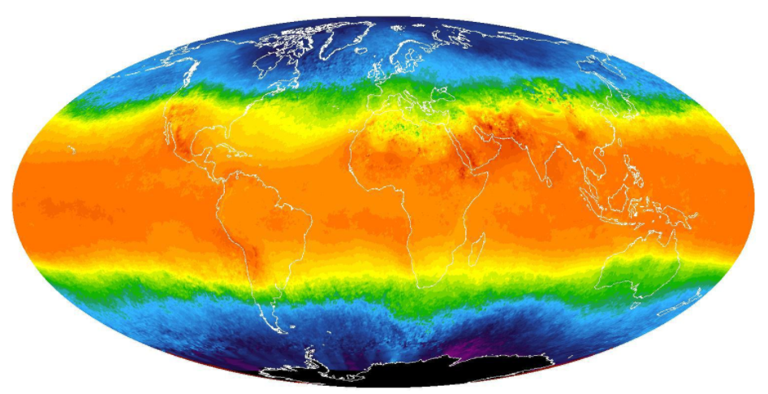
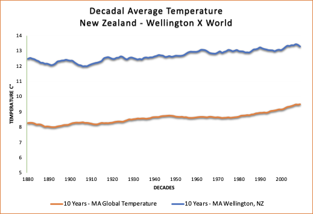
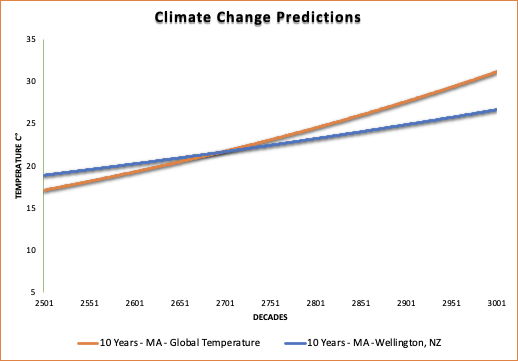
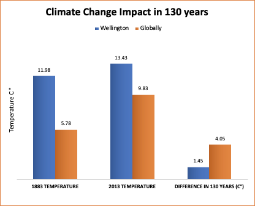

# Weather trends

**Summary**
This project is a comparison between the global average temperature against the capital of New Zealand, Wellington.

**Key considerations:**
Show clear data, be easy to read and show relevant information that can help to shape action plans.

**1-Extracting**

I downloaded all Udacity's database available by executing the followings commands in the SQL workspace.

    SELECT * FROM global_data
    SELECT * FROM city_list
    SELECT * FROM city_data

In addition, in the SQL workspace, I ran the following code to visualise all available data in the New Zealand and I saved this into a new spreadsheet called “**city_data_where_nz":**

      SELECT * FROM city_data WHERE country='New Zealand'

**2-Merging information**

Then I opened the spreadsheet **global_data** and then created **city_data_where_nz** with Excel.

In the spreadsheet **global_data,** I created a new column called "Wellington, NZ" and I used the VLOOKUP in order to get all values from the another spreadsheet:

    =IFERROR(VLOOKUP(A105,city_data_where_nz.csv!$A:$D,4,FALSE),"Not Available")

The ifError formula was needed because for some years the database had no data for Wellington, therefore, I decided to leave the cells as "not available", which means that the data could not be found in the **city_data_where_nz** spreadsheet .
Then I applied a filter in order to keep only the years where I could find data in both compared spreadsheets.

**3- Calculations**

I used this way to find out what was the percentage difference over the years.

And the following formulas to create this table:

The moving average used to smooth the data was taken by 10 years time.

**4- Charts**

**5- Predictions**

This is a rough predictions of temperature in the next years globally and locally.

I have got the global and local average temperature and I used its rate as a constant to find what would be the next year temperature.

    Logic: (Previous year temperature X Mean temperature increase rate)+ Previous year temperature
    Formula:(B12*global_data!$K$115)+B12

**Final considerations:**

- Both average temperatures have been increasing over time.
- Both have a higher average temperature now comparing with the past.
- Over 130 years, the Wellington temperature increased 1.45 C° and the global temperature 4.05C°.
- The Wellington temperature has not been increasing as the global is.
- The global temperature increase rate is higher than in Wellington, which means the world itself has a more climate impact than Wellington.
- The global data has a lower standard error, which means fewer fluctuations, more data reliability.
- The global average temperature has been approaching the Wellington temperature over the years.
- The global temperature would match with the Wellington around the year 2696.
- The Wellington city in New Zealand apparently do more effective environmental protective actions than other countries. Further investigaiton required.

**References:**

Accessed at 03/05/2020:
https://www.usatoday.com/story/money/2019/07/14/climate-change-countries-doing-most-least-to-protect-environment/39534413/
